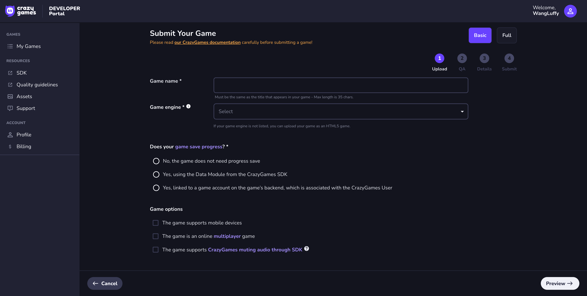
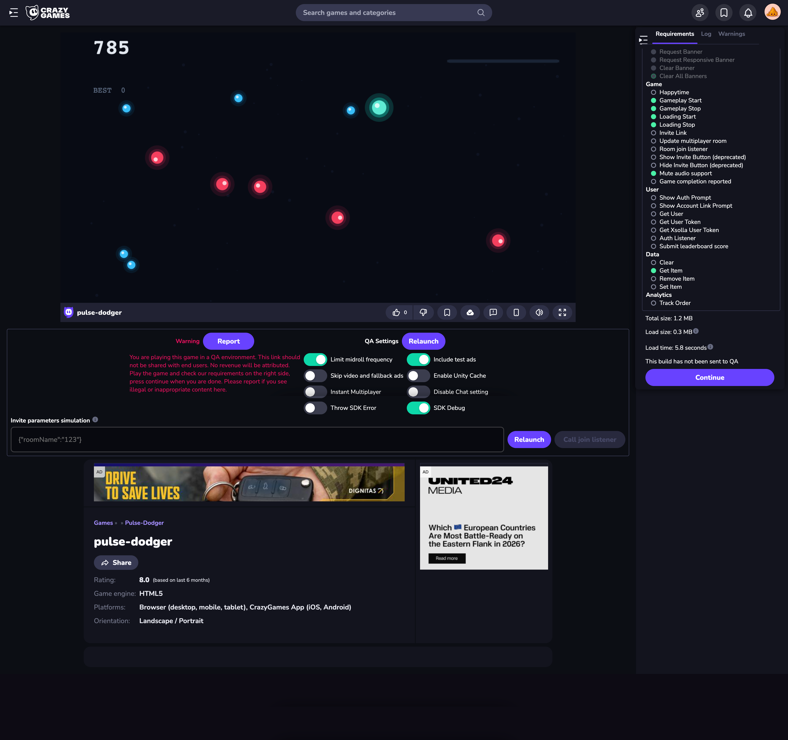
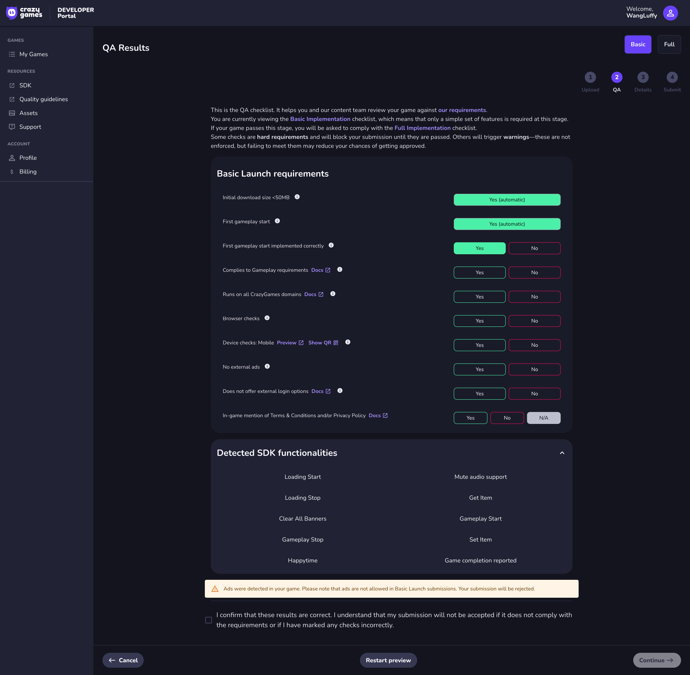
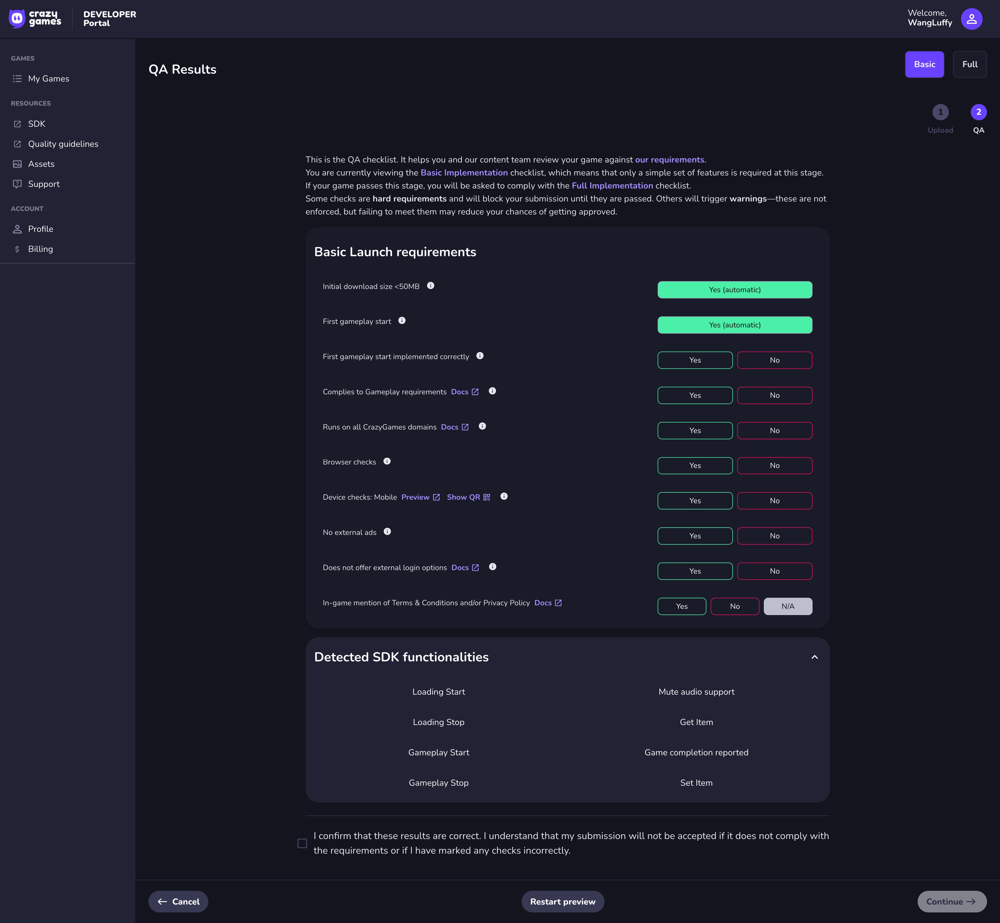
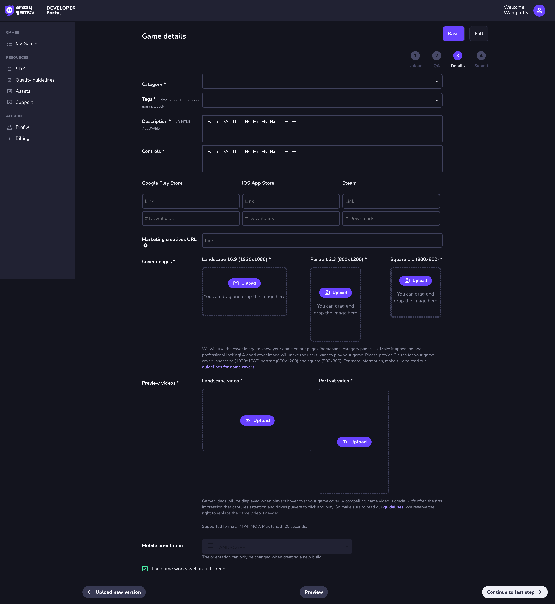
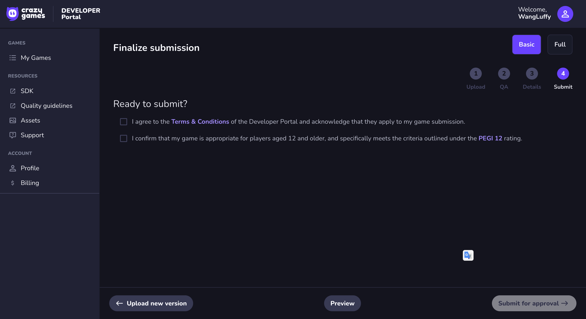
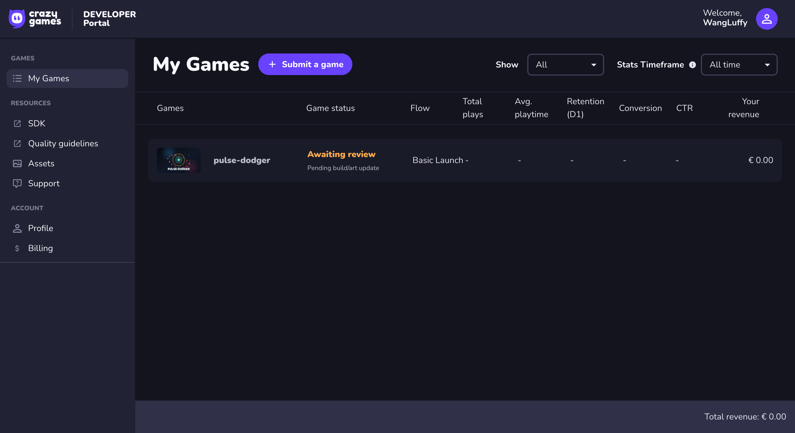
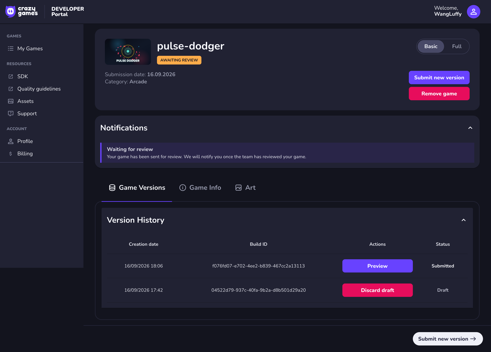

# CrazyGames 一日提交与上架作战手册

Last checked：2026-09-17

一句话定位：这是一份面向新手开发者的图文 runbook，目标是用 AI 辅助把一款 HTML5 小游戏做到可提交 CrazyGames，并继续跟进到公开可玩、数据观察和 Full Launch/变现准备。

## 行文主旨

本文不试图把“游戏开发”一次性讲完，也不承诺“一天必然公开上架”。本文只服务一个可执行目标：

```
用 AI 快速做出一款可玩的 HTML5 小游戏
-> 补齐 CrazyGames 提交材料
-> 通过 Developer Portal Preview
-> 提交到 CrazyGames 审核队列
-> 等审核通过后验证真实游戏页可玩
-> 再根据 Basic Launch 数据决定是否推进 Full Launch 和变现
```

对新手来说，最大的风险不是不会写代码，而是把下面几件事混成一团：

```text
开发完成 != 可提交
可提交 != 审核通过
审核通过 != 搜索立刻可见
Basic Launch != 已经变现
接入 SDK != Basic 阶段能显示广告
```

所以本文的写法是：

```text
先建立心智模型
再给新手 10 步主线
再给环境、材料、Portal、SDK、QA 的具体步骤
最后记录 Pulse Dodger 的真实提交流程作为案例
```

## 心智模型

把 CrazyGames 上架想成一条流水线，而不是一个上传按钮：

```text
游戏本体 Game
  玩法闭环：开始 -> 游玩 -> 失败/胜利 -> 结算 -> 重试
  工程闭环：dev -> build -> preview -> package
  质量闭环：英文、移动端、包体、性能、素材授权

平台合同 Platform Contract
  你声明什么，平台就测什么：
    mobile -> 测手机
    save progress -> 测存档
    mute audio -> 测 SDK 静音
    multiplayer -> 测多人要求
    ads -> 测广告禁用/失败恢复

商店材料 Store Assets
  玩家看到什么，决定要不要点进来：
    name
    category / tags
    description / controls
    screenshots
    landscape / portrait / square covers
    landscape / portrait preview videos

平台流程 Portal Flow
  Upload -> Preview -> QA Results -> Details -> Finalize -> Awaiting review
  这一步完成后只是提交审核，不是公开上架。

上线生命周期 Launch Lifecycle
  Awaiting review
  -> Initial QA accepted / rejected
  -> Basic Launch
  -> Public URL playable
  -> Dashboard metrics
  -> Updates
  -> Full Launch review
  -> Monetization / payout
```

最重要的一句话：

```text
一天内你高确定性可以完成的是“提交到审核队列”，不是“保证公开上架并赚钱”。
```

## 新手 10 步主线

如果你第一次做，不要从 1500 行文档里找入口，先按这 10 步走：

```text
1. 准备账号和环境：CrazyGames Developer Portal、Billing、Node、Chrome、ffmpeg、手机测试设备。
2. 选技术路线：Phaser + TypeScript + Vite + CrazyGames HTML5 SDK v3。
3. 选一个简单玩法：2D arcade / avoider / catcher，不做多人、不做 IAP、不做复杂 3D。
4. 让 AI 基于模板或开源项目结构做原创改造，不直接搬素材、UI、关卡、名字。
5. 本地跑通：开始、游玩、结算、重试、英文界面、手机触摸。
6. 接平台层：PlatformAdapter、loadingStart/Stop、gameplayStart/Stop、muteAudio；Basic 阶段不要触发广告 SDK。
7. 打包检查：build 成功、上传目录根部有 index.html、相对路径、包体和文件数达标。
8. 生成材料：metadata、3 张截图、3 套 cover、横版/竖版 preview video、asset license。
9. 进入 Developer Portal：Upload -> Preview -> QA Results -> Details -> Finalize。
10. 提交后记录状态：Awaiting review 不等于上架；等 Basic Launch 后再验证真实 CrazyGames 游戏页。
```

这 10 步中，最容易卡死的是：

| 卡点 | 快速判断 |
| --- | --- |
| Billing | 没完成会在最终提交时报 `Error fetching payment details`；可先用 `Hold Payments` 跑通提交 |
| Save progress | 没接 CrazyGames Data Module 就选 `No`；已完全用 SDK Data 读写才选 Data Module |
| Upload | 当前 Portal 可能不收 zip；直接拖上传目录里的 `index.html` 和 `assets/` |
| Ads | Basic Launch 禁用广告；不要触发 ads/banner SDK 调用 |
| Preview videos | 需要横版和竖版，15-20 秒，无声音 |
| 上架判断 | `Awaiting review` 只是提交成功；有公开 CrazyGames URL 且普通玩家能玩，才算公开可玩 |

## 开始前准备

在写游戏前先准备这些，否则你会在最后一步被非代码问题卡住。

| 类型 | 必备项 | 用途 |
| --- | --- | --- |
| 账号 | CrazyGames Developer Portal | 创建游戏、上传 build、Preview、提交审核 |
| 账号 | Billing onboarding | 最终提交前可能校验付款资料；可先选择 `Hold Payments` |
| 本地运行 | Node.js / npm | 跑 Phaser + Vite 工程 |
| 本地浏览器 | Chrome | 本地测试和截图自动化最稳 |
| 视频工具 | `ffmpeg` | 生成 15-20 秒横版/竖版 preview video |
| 测试设备 | 手机浏览器 | 勾选 mobile 前必须真机玩过 |
| AI 工具 | Codex / Claude | 生成代码、审查 SDK 接入、产出素材脚本和文档 |

最低环境检查：

```bash
node -v
npm -v
ffmpeg -version
```

如果 `ffmpeg` 没有安装，先不要等到 Portal 的 `Game details` 页面才处理；没有 preview video 会卡在素材提交环节。

## 三个关键决策树

### 是否接 SDK

```text
只想最快 Basic 提交：
  SDK 可选。
  重点是 build、玩法、移动端、英文、素材、Portal Preview。

想让第一款变成后续模板：
  接最小 SDK。
  范围：init、environment、loading、gameplayStart/Stop、muteAudio。

想为 Full Launch 和变现做准备：
  接完整 SDK。
  但广告按钮必须受能力位控制，Basic 阶段不能让无效广告伤害体验。
```

### Save progress 怎么选

```text
没有存档：
  选 No, the game does not need progress save。

只用了浏览器 localStorage，且没有接 CrazyGames Data Module：
  第一款保守选 No。

已经通过 CrazyGames SDK Data Module 读写最高分、进度或设置：
  选 Yes, using the Data Module from the CrazyGames SDK。

有自己后端账号系统，并且和 CrazyGames User 关联：
  才选 linked to a game account on the game's backend。
```

### Basic 阶段广告怎么处理

```text
Basic Launch:
  monetization disabled
  不要触发 requestAd / banners
  不显示无效 rewarded 按钮

Full Launch:
  只通过 CrazyGames SDK 请求广告
  midgame 放自然断点
  rewarded 必须玩家主动触发
  adError / adblock / unfilled 必须恢复游戏
```

### 什么状态才算上架

```text
Submitted / Awaiting review：
  只代表提交成功。
  不能在正式站搜索到是正常的。

Accepted / Basic Launch：
  代表通过初始 QA，开始小流量公开测试。
  需要拿正式 CrazyGames 游戏 URL 做玩家视角验收。

Public URL playable：
  普通玩家不用登录开发者后台也能打开并完整玩一局。
  这才算“公开可玩”的上架闭环。

Full Launch：
  代表平台认为数据和接入质量足够进入完整发布。
  这时才进入广告变现和更大流量的主线。
```

## 先纠偏

你的真实目标不是：

```text
定义什么叫一天上架一款
列一堆技术栈和资料链接
证明 AI 能不能写小游戏
```

你的真实目标是：

```text
今天拿一个可复刻学习的开源工程
用 AI 改造成原创小游戏
接入 CrazyGames SDK
跑通本地、Preview tool、Developer Portal 提交
跟进 QA 结果
进入 Basic Launch 后验证玩家能在 CrazyGames 打开并完整玩一局
根据 dashboard 和反馈更新游戏
为 Full Launch 和变现准备完整接入
沉淀可复用模板
让下一款游戏的边际成本下降
```

本文的完成定义分 5 个里程碑，不再只看本地或 Portal：

```text
M0 Submission Ready：本地 build、SDK、素材、metadata、cover、QA 证据齐全。
M1 Submitted：Developer Portal 中完成 Preview 验收并提交。
M2 Accepted / Basic Launch：通过 CrazyGames 初始 QA，进入 Basic Launch。
M3 Public Playable：拿到 CrazyGames 游戏页，在桌面和手机端各完整玩一局。
M4 Full Launch Ready：根据 Basic Launch 数据和反馈，补齐 Full Implementation、广告、支付和更新流程。
```

注意边界：

```text
你能控制：开发、SDK 接入、构建、上传、预览、提交、记录、更新、复测。
你不能控制：CrazyGames 当天审核通过、当天公开上线、当天进入 Full Launch、当天产生收入、平台给多少流量。
```

如果平台审核还没通过，不能自欺欺人说“已经公开上线”；如果没有拿 CrazyGames 游戏页并在真实平台环境完整玩一局，也不能说“成功上架并可玩”。

## 全生命周期地图

你要跑通的是这条链：

```text
Idea（选题）
-> Build（开发）
-> SDK Integration（平台接入）
-> Local QA（本地验收）
-> Portal Preview（平台预览）
-> Submit（提交）
-> Initial QA（CrazyGames 初始审核）
-> Basic Launch（小流量公开测试）
-> Public Playable Verification（真实游戏页可玩验证）
-> Dashboard & Feedback（数据和玩家反馈）
-> Update（提交更新）
-> Full Launch Review（完整上线审核）
-> Monetization & Payout（广告变现和收款）
```

一日内现实目标：

```text
高确定性目标：M0 + M1。
取决于平台目标：M2 + M3。
后续运营目标：M4。
```

所以本文不是承诺“今天一定公开上线”，而是指导你把开发者可控部分做到足够完整，并把平台不可控部分转成明确跟进动作。

## 本次真实提交复盘：Pulse Dodger

本次 `Pulse Dodger` 已完成从本地 build 到 Developer Portal 提交的 M0/M1 链路，当前处于审核等待态：

```text
M0 Submission Ready：完成。
M1 Submitted：完成。
M2 Accepted / Basic Launch：等待 CrazyGames review。
M3 Public Playable：等待正式 CrazyGames 游戏页。
M4 Full Launch Ready：后续根据 Basic Launch 数据推进。
```

当前 Portal 看到的状态：

```text
My Games -> pulse-dodger
Game status: Awaiting review
Detail page notification: Waiting for review
Version History: Submitted
```

这代表“提交成功，等待审核”，不代表已经公开上架。此阶段可以在 Developer Portal 的 Preview 里玩，也可以本地继续测试，但普通玩家通常还不能在 CrazyGames 正式站搜索到或打开你的游戏。

### 图源维护规则

`.data/` 只作为临时截图池，不作为长期文档图源。进入本文的截图统一放到当前文档旁边的 `assets/`：

```text
game-side-hustle/practice/crazygames-daily-launch-plan/
  crazygames-daily-launch-plan.md
  assets/
```

维护原则：

```text
1. 图片必须重命名，使用步骤序号 + 英文语义名。
2. 不在文档里引用 image copy.png 这类临时文件名。
3. Portal 流程截图放 `assets/`。
4. 游戏提交素材继续放具体游戏项目的 materials/。
5. 替换同一页面截图时优先保持同名文件，减少文档链接漂移。
```

截图索引：

| 步骤 | 截图 | 说明 |
| --- | --- | --- |
| Upload | [01-upload-step.png](./assets/01-upload-step.png) | Submit Your Game 第 1 步，填写 game name、engine、save progress、game options |
| Preview | [02-preview-tool-runtime.png](./assets/02-preview-tool-runtime.png) | Portal Preview 运行态，右侧会显示 SDK requirements |
| QA warning | [03-qa-results-ads-warning.png](./assets/03-qa-results-ads-warning.png) | Basic Launch 中触发 ads SDK 的错误示例 |
| QA clean | [04-qa-results-clean.png](./assets/04-qa-results-clean.png) | 移除 Basic ads 调用后的 QA Results |
| Details | [05-game-details-form.png](./assets/05-game-details-form.png) | 填 category、tags、description、controls、cover、video |
| Finalize | [06-finalize-submission.png](./assets/06-finalize-submission.png) | 勾选 Terms 和 PEGI 12 后提交 |
| My Games | [07-my-games-awaiting-review.png](./assets/07-my-games-awaiting-review.png) | 列表页 Awaiting review 状态 |
| Game detail | [08-game-detail-awaiting-review.png](./assets/08-game-detail-awaiting-review.png) | 游戏详情页 Waiting for review 和 Version History |

## 已有小游戏的上架分诊

如果你已经写好了小游戏，不要再从“创建工程模板”开始。先做分诊。

```text
第一问：我现在只想最快提交 Basic Launch，还是想顺手打通后续 Full Launch/变现？
第二问：游戏现在能不能 production build，并且 Portal 上传目录根部有 index.html？
第三问：游戏有没有英文界面、开始/游玩/结算/重试完整流程？
第四问：素材来源和商用授权是否能说清？
第五问：手机端是否真的可玩？
```

### 是否需要接入 SDK

结论：

```text
只求 Basic Launch：SDK 可选，可以先不接。
想进入 Full Launch / 变现 / 平台数据更完整：必须接 SDK。
已经有开发能力并且愿意多花半天：建议至少接 game module，不急着暴露广告按钮。
```

怎么选：

| 你的目标 | SDK 决策 | 提交策略 |
| --- | --- | --- |
| 今天最快提交 Basic | 可以不接 SDK | 重点保证 build、玩法、移动端、封面、metadata、无侵权 |
| 想顺手打通平台链路 | 接最小 SDK | 只接 init、loading、gameplayStart/Stop、muteAudio，不做复杂广告 UI |
| 想准备 Full Launch 和收入 | 接完整 SDK | 补 ads、banner、game events、muteAudio、data/user 视游戏需要 |
| 游戏还很粗糙 | 先不接广告 | 先修可玩性和 QA，广告按钮失败会增加拒审风险 |

最小 SDK 接入范围：

```text
必须：
  index.html 加载 SDK v3 script
  await window.CrazyGames.SDK.init()
  检查 environment
  loadingStart / loadingStop
  gameplayStart / gameplayStop
  muteAudio settings + listener

可选：
  happytime
  report progress
  data module 云存档
  rewarded / midgame ads
  banners
```

Basic 阶段最容易踩的坑：

```text
接了 Ads SDK，但 Basic Launch 广告禁用，按钮点了没效果。
接了 mute audio 选项，但游戏没有响应 CrazyGames 播放器静音。
接了 SDK，但在 disabled environment 直接崩。
gameplayStart 太早触发，导致 initial download size 统计失真。
gameplayStop 漏掉，平台以为玩家一直在玩。
```

### 已有游戏最短上架路径

如果你的游戏已经可玩，按这个顺序做：

```text
1. 先跑 production build。
2. 检查 Portal 上传目录结构：index.html 必须在根目录。
3. 做 English UI / instructions / short description / long description。
4. 准备 3 张截图、3 个 cover、横版和竖版 preview video。
5. 检查素材 license。
6. 决定 SDK 策略：不接 / 最小接 / 完整接。
7. 本地 localhost 测一局。
8. 真机测一局。
9. Developer Portal 选 Basic + HTML5。
10. Preview tool 完整玩一局。
11. 提交。
12. 等 Initial QA，按反馈重提。
```

已有 Phaser 项目建议直接对照这篇实操教程补 SDK 和打包脚本：[phaser-crazygames-手把手实操教程.md](../phaser-crazygames-手把手实操教程.md)。

### 真机测试通过后的下一步

你现在的位置：

```text
已完成：真实手机上玩过一局，主流程没有明显问题。
下一步：不要继续加玩法，进入 M0 Submission Ready 收口。
目标：把 demo 变成 CrazyGames 可提交包。
```

这一阶段只做 6 件事：

```text
1. 冻结玩法 scope。
2. 补齐英文界面和提交文案。
3. 决定 SDK 策略。
4. 生成 production build、Portal 上传目录和本地归档 zip。
5. 准备截图、cover、横版/竖版 preview video、license 记录。
6. 在 Developer Portal Preview 完整玩一局后提交。
```

不要再做：

```text
新增第二套玩法。
新增复杂关卡系统。
新增账号、排行榜、多人、IAP。
临时换技术栈。
为了“更完整”加广告按钮但没有处理 Basic Launch 禁用。
```

### M0 Submission Ready 收口清单

真机测过后，用这张表判断能不能进 Portal。

| 项目 | 必须状态 | 记录位置 |
| --- | --- | --- |
| 游戏主流程 | 开始、游玩、失败/胜利、结算、重试都完整 | 项目内 `docs/submission-ready-checklist.md` |
| 英文界面 | 所有玩家可见文案是英文，不出现中文测试文案 | 项目内 `docs/submission-ready-checklist.md` |
| 手机端 | 真机至少完整玩一局，触摸、音频、布局无明显问题 | 项目内 `docs/submission-ready-checklist.md` |
| 桌面端 | Chrome 桌面完整玩一局，控制台无 error | 项目内 `docs/submission-ready-checklist.md` |
| Build | `npm run build` 成功，`dist/` 可静态预览 | 项目内 `docs/submission-log.csv` |
| Portal upload | `index.html` 在上传目录根部，资源路径相对 | 项目内 `docs/submission-log.csv` |
| 包体 | total size、initial size、file count 已记录 | 项目内 `docs/submission-log.csv` |
| SDK | 决定不接、最小接或完整接，并记录原因 | 项目内 `docs/submission-ready-checklist.md` |
| 素材 | 所有图片、音效、字体、模型来源可解释 | 项目内 `docs/asset-license.csv` |
| 截图 | 菜单、游玩中、结算页至少 3 张 | 项目内 `docs/submission-log.csv` |
| Cover | landscape、portrait、square 三套封面 | 项目内 `docs/submission-log.csv` |
| Preview videos | 横版和竖版各 15-20 秒，展示真实玩法，无声音、无促销文字 | 项目内 `docs/submission-log.csv` |
| Portal | Basic + HTML5，按真实能力勾选 mobile / muteAudio | 项目内 `docs/submission-log.csv` |

### 现在是否该接 SDK

如果你想最快提交：

```text
可以先不接 SDK，按 Basic + HTML5 提交。
代价：没有 SDK gameplay events，未接 Full Launch / 广告变现链路。
适合：你想先验证 CrazyGames QA 和 Basic Launch 流程。
```

如果你想把这个 demo 做成后续模板：

```text
建议接最小 SDK。
范围：init、environment、loadingStart/Stop、gameplayStart/Stop、muteAudio。
暂不暴露：rewarded ad / midgame ad 按钮。
适合：你想让下一款游戏直接复用平台层。
```

如果你已经按手把手教程接好了 SDK：

```text
不要继续扩 SDK 功能。
先确认 localhost 日志、Preview tool 行为、muteAudio、gameplayStart/Stop 都正常。
广告可以接在适配层，但 Basic 阶段不要让无效广告按钮出现在 UI 上。
```

### 当前 demo 推进记录

每次推进都在这里留一条状态，避免凭感觉判断“差不多了”。

```csv
date,game_name,stage,mobile_playtest,desktop_playtest,sdk_strategy,build_ready,assets_checked,materials_ready,portal_preview,submitted,next_action
2026-09-17,Pulse Dodger,awaiting_review,yes_user_reported,portal_preview_passed,basic_sdk_no_ads,yes,yes_self_made,yes,yes,yes,wait_for_crazygames_review
```

本次项目级复用材料：

```text
pulse-dodger/docs/submission-ready-checklist.md：一款游戏提交前逐项收口。
pulse-dodger/docs/submission-log.csv：每次打包、材料、Portal Preview、提交状态留痕。
pulse-dodger/docs/asset-license.csv：素材来源和商用授权留痕。
pulse-dodger/materials/：metadata、3 张截图、3 套 cover、18 秒横版/竖版 preview videos。
pulse-dodger/submissions/portal-upload/：当前 Portal 需要拖拽上传的 HTML5 文件目录。
pulse-dodger/submissions/pulse-dodger.zip：离线归档包；如果 Portal 提示 archive files are not supported，不上传它。
crazygames-daily-launch-plan/assets/：本文使用的 Portal 流程截图，已从 .data 临时截图重命名后归档。
```

下一步建议：

```text
当前不要重复创建 Submit a game。
每天检查 Developer Portal 状态和注册邮箱。
如果审核通过：拿正式 CrazyGames 游戏页，在桌面和手机各完整玩一局。
如果被退回：只按 QA feedback 修复，重新 build、Preview、Submit。
```

## Submit a game 心智模型

`Submit a game` 不是一个普通上传表单。它本质上是在问 CrazyGames 审核团队 5 个问题：

| 根本问题 | 通俗说法 | 你要给出的答案 | 常用度 |
| --- | --- | --- | --- |
| 这个游戏怎么运行 | 平台怎么加载你的游戏 | 选择 engine（引擎）/ hosting（托管方式），上传 web build 或提供 iframe | 地基 |
| 这个游戏像不像成品 | QA 要不要放行 | 提供可玩的 build、英文 metadata、controls、截图、cover、preview videos | 地基 |
| 这个游戏能不能在目标设备玩 | 玩家打开会不会白屏/卡死/无法操作 | 声明 mobile、orientation、输入方式，并通过 Preview 和真机测试 | 地基 |
| 这个游戏有没有平台义务 | 你勾选了什么，平台就会测什么 | save progress、multiplayer、mute audio、SDK、ads、account integration | 地基 |
| 这个游戏能不能上线后增长 | Basic Launch 后值不值得继续推 | cover、首屏、玩法、retention、conversion、feedback、更新能力 | 进阶 |

先建立这个认知：

```text
页面选项不是“偏好设置”，而是“审核承诺”。
你勾选了 mobile，QA 就会按移动端测。
你勾选了 mute audio，QA 就会按 CrazyGames SDK 静音要求测。
你说保存进度，QA 就会检查 Data Module 或账号级保存链路。
你选 externally hosted，收入和 SDK 就依赖外部托管链路是否正确。
```

对你当前第一款游戏，安全默认选择：

```text
Launch tab：Basic
Game engine：HTML5
Save progress：如果只是 localStorage，选 No；如果已接 CrazyGames data module，按真实能力选 Yes
Supports mobile devices：只有真机触摸测过才勾
Online multiplayer：No
Supports CrazyGames muting audio through SDK：只有实现并测试 muteAudio 后才勾
Hosting：上传 HTML5 build，不走 externally hosted iframe
```

对 `Pulse Dodger` 当前项目，建议选择：

```text
Launch tab：Basic
Game engine：HTML5
Game name：Pulse Dodger
Save progress：Yes, using the Data Module from the CrazyGames SDK
Supports mobile devices：Yes
Online multiplayer：No
Supports CrazyGames muting audio through SDK：Yes
Hosting：上传 HTML5 build files；如果 Portal 不支持 archive，就拖 dist/ 或 submissions/portal-upload/ 里的文件
```

### Portal 四步详细流程

CrazyGames 的 `Submit a game` 当前按 4 个步骤推进：

```text
1 Upload：上传 build，并声明游戏能力。
2 QA：平台预览和 Basic Launch 要求检查。
3 Details：填写商店页资料，上传 cover 和 preview videos。
4 Submit：确认条款、年龄适配、Billing，然后提交审核。
```

#### Step 1：Upload



`Pulse Dodger` 这次的实际填写：

| 字段 | 选择 / 填写 |
| --- | --- |
| Launch tab | `Basic` |
| Game name | `Pulse Dodger` |
| Game engine | `HTML5` |
| Save progress | `Yes, using the Data Module from the CrazyGames SDK` |
| Supports mobile devices | 勾选 |
| Online multiplayer | 不勾选 |
| Supports CrazyGames muting audio through SDK | 勾选 |
| Upload files | 拖 `submissions/portal-upload/` 里的 `index.html` 和 `assets/` |

关键坑：

```text
不要上传 pulse-dodger.zip。
如果 Portal 提示 Archive files are not supported，就打开 portal-upload 目录，直接拖 index.html 和 assets/。
```

#### Step 2：Preview 和 QA Results

Preview 运行态：



Basic Launch 中错误触发 ads SDK 的警告：



移除 Basic ads 调用后的 QA Results：



这一步先点 `Preview`，在 CrazyGames 提供的 QA preview 环境完整玩一局。通过后回到 `QA Results`，按真实结果选择：

| QA 项 | `Pulse Dodger` 当前选择 |
| --- | --- |
| First gameplay start implemented correctly | `Yes` |
| Complies to Gameplay requirements | `Yes` |
| Runs on all CrazyGames domains | `Yes` |
| Browser checks | `Yes` |
| Device checks: Mobile | `Yes`，前提是真机或二维码测过 |
| No external ads | `Yes` |
| Does not offer external login options | `Yes` |
| In-game mention of Terms & Conditions and/or Privacy Policy | `N/A` |

这次实际踩坑：

```text
Basic Launch 阶段如果检测到 ads SDK 调用，页面会提示 Ads were detected。
Basic 阶段不要触发 requestAd、requestResponsiveBanner、clearAllBanners 等广告相关调用。
广告代码可以留在适配层设计里，但 Basic 提交 build 不能调用广告 SDK。
```

通过标准不是“右侧全部都是绿色”。有些 SDK 功能你没有实现就不会出现，重点是当前 Basic 必需项不报 blocker，不出现会导致拒审的 warning。

#### Step 3：Game details



这一页是商店页资料，不是游戏运行配置。`Pulse Dodger` 这次按下面填：

| 字段 | 填写 / 上传 |
| --- | --- |
| Category | `Arcade` |
| Tags | 优先选 `Avoid`、`Skill`、`Survival`、`2D`、`Singleplayer`；没有就选接近项 |
| Description | 使用 `materials/metadata.md` 的 long description |
| Controls | 用纯文本，不用 Markdown 列表 |
| Google Play Store | 留空 |
| iOS App Store | 留空 |
| Steam | 留空 |
| Marketing creatives URL | 留空 |
| Landscape cover | `pulse-dodger/materials/covers/landscape-1920x1080.png` |
| Portrait cover | `pulse-dodger/materials/covers/portrait-800x1200.png` |
| Square cover | `pulse-dodger/materials/covers/square-800x800.png` |
| Landscape video | `pulse-dodger/materials/videos/preview.mp4` |
| Portrait video | `pulse-dodger/materials/videos/preview-portrait.mp4` |
| Mobile orientation | 保持 Portal 当前 build 的 orientation |
| The game works well in fullscreen | 勾选 |

`Controls` 建议粘贴成一段纯文本：

```text
Desktop: Move with mouse. Click or press Space to release a pulse. Press Esc to pause.

Mobile: Drag to move. Tap to release a pulse when charged.
```

不要粘贴这种带缩进的 Markdown 列表：

```text
Desktop:
  - Move with mouse.
  - Click or press Space to release a pulse.
```

原因：Portal 的富文本编辑器可能把缩进、列表或换行解析成异常格式；纯文本最稳。

#### Step 4：Finalize submission



这一步只做最终确认：

```text
1. 勾选同意 Developer Portal Terms & Conditions。
2. 勾选确认游戏适合 12 岁及以上玩家，并符合 PEGI 12。
3. 点击 Submit for approval。
```

`Pulse Dodger` 当前是无血腥、无赌博、无成人内容、无聊天社交、无外部登录的街机闪避游戏，按当前内容可以确认 PEGI 12。

如果点击提交时报：

```text
Error fetching payment details, please ensure you have completed billing details in the Billing tab.
```

处理路径：

```text
Account -> Billing
完成 Tipalti onboarding
Payment method 可以先选择 Hold Payments
Tax/VAT 如果没有欧盟 VAT number，选择 I am not VAT registered in the European Union
看到 Done / You are all set 后，回到游戏提交页重新 Submit
```

注意：`Hold Payments` 不是放弃收入，而是先挂账不打款。第一款游戏的目标是先跑通提交审核链路，正式收款方式可以后续再补。

#### 提交成功后怎么看

My Games 列表状态：



游戏详情页状态：



看到下面状态，表示提交成功但还没有公开上线：

```text
Game status: Awaiting review
Notification: Waiting for review
Version History: Submitted
```

这一阶段的正确理解：

```text
可以做：本地继续测试、Portal Preview 复测、等待邮件和 Portal 反馈。
不能做：在 CrazyGames 正式站搜索到游戏、让普通玩家直接打开正式游戏页。
不能宣称：已经公开上架、已经开始变现。
```

为什么 `Game engine` 选 `HTML5`：

```text
Phaser / PixiJS / Three.js / 原生 Canvas / Vite / TypeScript 最终都是 HTML5 web build。
CrazyGames 的下拉框不是在问你具体 JS 框架，而是在问平台该用哪条运行和 QA 路径。
```

什么时候不选 `HTML5`：

| 选项 | 什么时候选 | 第一款是否建议 |
| --- | --- | --- |
| Externally hosted (iframe) | 游戏文件放在你自己的服务器，CrazyGames iframe 你的 URL | 不建议 |
| Unity 版本项 | 你用 Unity WebGL 对应版本导出 | 不建议第一款 |
| Godot | 你用 Godot Web export 并接对应 SDK | 不建议第一款 |
| Cocos | 你用 Cocos Creator 并接对应 SDK | 可后续尝试 |
| Construct / GDevelop | 你用可视化引擎导出 HTML5 | 可后续尝试 |
| PlayCanvas / Defold / GameMaker | 你实际使用这些引擎导出 | 可后续尝试 |

支持引擎的正确理解：

```text
CrazyGames 支持很多引擎，不代表第一天都要学。
主线只选 HTML5 + Phaser/TypeScript/Vite。
其他引擎只是未来扩展路线，不进入第一款执行路径。
```

## 提交材料总览

在写代码前先知道要交什么。否则你会出现“游戏做好了，但封面、视频、描述、控制说明、SDK 承诺没准备”的阻塞。

### 必交材料

| 材料 | 用途 | 第一款怎么准备 |
| --- | --- | --- |
| Game build | 平台实际运行的游戏文件 | `npm run portal:upload` 后拖 `submissions/portal-upload/` 里的 `index.html` 和 `assets/` |
| Game name | 平台展示和审核识别 | 英文、35 字符以内、和游戏内标题一致 |
| Game engine | 决定 QA 和运行路径 | 选 `HTML5` |
| Metadata | 玩家和 QA 理解玩法 | short description、long description、instructions、controls |
| Category | 决定展示和竞品环境 | 第一款选 `Arcade`，不要乱选热门分类 |
| Orientation | 平台如何要求玩家旋转设备 | 按实际体验选 portrait / landscape / both |
| Screenshots | 证明游戏真实可玩 | 至少准备菜单、游玩中、结算页 |
| Cover images | 商店橱窗点击率 | 准备 landscape、portrait、square 三套封面 |
| Preview videos | 鼠标悬停/卡片预览 | 横版和竖版各 15-20 秒真实玩法视频，不要黑屏、logo 过场、鼠标光标和营销字 |
| SDK evidence | 证明平台接入没破坏体验 | qa-report 记录 init、environment、gameplayStart/Stop、广告失败恢复 |
| Asset license | 证明不是侵权或搬运 | `asset-license.csv` 记录素材来源和商用许可 |

### 材料和页面字段的关系

```text
Upload step:
  Game name
  Game engine
  Save progress
  Game options
  Build upload / Preview

QA step:
  平台检查 build、SDK、设备、性能、路径、资源、广告、静音、移动端。

Details step:
  description、instructions、category、orientation、cover、screenshots、preview videos。

Submit step:
  确认所有材料和 QA 结果后正式提交。
```

### 第一款不要承诺的能力

```text
不要承诺账号保存。
不要承诺多人。
不要承诺复杂云存档。
不要承诺 IAP。
不要承诺外部托管。
不要勾选你没有实现和测试过的 SDK 能力。
```

### 材料生产 SOP

对每一款游戏，都建议固定产出下面这个目录。具体路径可以跟随游戏名变化，但结构不要变：

```text
materials/
  metadata.md
  screenshots/
    menu.png
    gameplay.png
    result.png
  covers/
    landscape-1920x1080.png
    portrait-800x1200.png
    square-800x800.png
  videos/
    preview.mp4
    preview-portrait.mp4
  sources/
    cover html / 原始素材 / 生成脚本中间产物
```

`metadata.md` 至少包含：

```text
Game name
Short description
Long description
Instructions
Controls
Suggested category
Suggested tags
Material paths
```

视频生成要求：

```text
Landscape preview video:
  16:9
  15-20 秒
  展示真实玩法
  无声音
  无默认鼠标光标
  无黑屏 logo 过场
  无 Play Now / promotional text

Portrait preview video:
  2:3
  15-20 秒
  可以从横版视频居中裁切生成，但必须确认核心玩法元素没有被裁掉
```

如果你已经有横版 `preview.mp4`，可以用 `ffmpeg` 临时生成 2:3 竖版视频：

```bash
ffmpeg -y -i materials/videos/preview.mp4 -vf 'crop=720:1080:600:0,scale=800:1200,format=yuv420p' -an -movflags +faststart materials/videos/preview-portrait.mp4
```

注意：上面的裁切参数只适合 `1920x1080` 横版源视频。其他分辨率要重新计算裁切区域，原则是保留中间玩法区域，再缩放到 2:3。

## 今天默认技术路线

第一天不要再纠结技术栈。默认路线：

```text
Phaser + TypeScript + Vite + CrazyGames HTML5 SDK v3
```

原因：

- CrazyGames SDK 的 HTML5 接入最直接。
- Phaser 适合 2D 小游戏，Scene（场景）、Input（输入）、Physics（物理）、Audio（声音）、Build（构建）都有成熟路径。
- Vite 构建快，适合 AI 高频迭代。
- TypeScript 方便 Codex/Claude 理解接口边界。
- 第一款游戏目标是打通流程，不是证明你能做所有类型。

第一款默认游戏方向：

```text
类型：2D arcade / catcher / avoider
玩法：玩家拖动或点击移动角色，躲避障碍、收集目标、获得分数，失败后一键重试。
时长：一局 45-90 秒。
资产：简单原创几何图形、AI 生成图标或 Kenney 可商用素材。
```

不要第一天做：

```text
多人联机
账号登录
IAP
复杂 3D
复杂关卡编辑器
长剧情
复杂物理车辆模拟
```

## 官方链路事实

今天只需要围绕这些官方事实执行：

| 主题 | 今天怎么理解 | 官方资料 |
| --- | --- | --- |
| 发布流程 | 游戏先提交给 CrazyGames QA；通过后进入 Basic Launch，表现好才可能进入 Full Launch | https://docs.crazygames.com/ |
| Basic vs Full | Basic Launch 可不定制 CrazyGames，SDK 可选且不变现；Full Launch 需要完整 SDK 和广告接入 | https://docs.crazygames.com/requirements/intro/ |
| Basic Launch 周期 | Basic Launch 是有限小流量测试，至少 7 天且达到 500 plays 才结束；否则最多到 21 天自动结束 | https://docs.crazygames.com/resources/basic-launch-metrics/ |
| 数据指标 | 重点看 average playtime、D1 retention、conversion to gameplay、反馈和评分 | https://docs.crazygames.com/resources/basic-launch-metrics/ |
| 技术要求 | 包体、文件数、初始下载、相对路径、浏览器和移动端是硬门槛 | https://docs.crazygames.com/requirements/technical/ |
| SDK 初始化 | HTML5 SDK v3 通过 script 引入，并且必须 `await window.CrazyGames.SDK.init()` 后再调用 SDK | https://docs.crazygames.com/sdk/intro/ |
| 本地测试 | `localhost` / `127.0.0.1` 支持 local SDK；其他域名 SDK 可能是 disabled | https://docs.crazygames.com/sdk/intro/ |
| 游戏事件 | `loadingStart`、`loadingStop`、`gameplayStart`、`gameplayStop`、`happytime`、进度上报都在 game module | https://docs.crazygames.com/sdk/game/ |
| 视频广告 | 只用 SDK 请求 `midgame` / `rewarded`；广告期间暂停和静音，失败时恢复游戏 | https://docs.crazygames.com/sdk/video-ads/ |
| 广告规则 | Basic Launch 广告禁用，不分享收入；Full Launch 才通过 SDK 广告变现 | https://docs.crazygames.com/requirements/ads/ |
| 游戏质量 | 英文、本地化、可读性、原创性、性能、无自定义 fullscreen、无外部推广 | https://docs.crazygames.com/requirements/gameplay/ |
| 封面素材 | 提交需要 cover images 和 preview videos | https://docs.crazygames.com/requirements/game-covers/ |
| 上线后管理 | 可以在 Developer Portal 看流量和反馈，也可以上传更新并提交审批 | https://docs.crazygames.com/faq/ |
| 收款准备 | 收入支付通过 Developer Portal 的 Billing/Tipalti 流程配置，未付收入达到最低门槛才支付 | https://docs.crazygames.com/payouts/ |

## 一天时间盒

### 00:00-00:30：确认 Portal 能走通

目标：不要写完游戏才发现平台入口卡住。

动作：

```text
1. 登录 https://developer.crazygames.com/
2. 进入 https://developer.crazygames.com/games
3. 点击 Submit a game。
4. 选择 Basic。
5. Game name 填英文名，必须和游戏内标题一致。
6. Game engine 选择 HTML5。
7. Save progress 按真实能力选择：没接 Data Module 选 No；已用 CrazyGames Data Module 读写进度才选对应 Yes。
8. Game options 按真实实现勾选，不要提前承诺。
9. 点击 Preview 前，确认今天需要准备哪些材料。
10. 如果 Portal 当前要求更多资料，记录到本文末尾的 submission-log。
```

页面选项怎么选：

| 页面字段 | 第一款建议 | 为什么 |
| --- | --- | --- |
| Basic / Full | `Basic` | 新游戏先走 Basic Launch，Full Launch 需要完整平台要求和变现接入 |
| Game name | 英文原创名 | 要和游戏内标题一致，避免碰瓷已有游戏 |
| Game engine | `HTML5` | Phaser/Three.js/PixiJS/Vite/TS 都属于 HTML5 web build |
| Save progress | `No` | 只用 `localStorage` 保存最高分，不等于 CrazyGames 账号级进度 |
| Supports mobile devices | 真机测过再勾 | 勾了就会按移动端 QA |
| Online multiplayer | 不勾 | 第一款不做多人，勾了会触发 multiplayer 要求 |
| Supports muting audio through SDK | 实现 `muteAudio` 后再勾 | 勾了就要支持 CrazyGames SDK 静音设置 |

不要选：

```text
Externally hosted (iframe)：除非你要自己托管游戏并让 CrazyGames iframe。
Unity/Godot/Cocos/Construct/GDevelop：除非你的项目确实由这些引擎导出。
```

失败处理：

```text
如果账号、地区、身份或后台入口卡住，今天目标改为：
完成 SDK-integrated build + 本地 SDK 测试 + 准备好 Portal 材料。
不要假装已经上架。
```

### 00:30-01:15：创建工程模板

如果你已经有游戏，这一段改成“现有项目体检”：

```text
npm run build 能不能过
dist/ 里有没有 index.html
静态服务打开 dist/ 是否可玩
资源路径是否都是相对路径
是否有英文标题、菜单、玩法、结算、重试
是否能在手机浏览器完整玩一局
```

如果你还没有项目，才创建工程模板。只用一个模板源：

```text
https://github.com/phaserjs/template-vite-ts
```

执行目标：

```text
npm install
npm run dev
npm run build
dist/ 可预览
```

工程最小目录：

```text
src/
  main.ts
  platform/
    PlatformAdapter.ts
    WebAdapter.ts
    CrazyGamesAdapter.ts
  scenes/
    BootScene.ts
    MenuScene.ts
    PlayScene.ts
    ResultScene.ts
  core/
    GameState.ts
    Score.ts
public/
  assets/
docs/
  qa-report.md
  asset-license.csv
  submission-log.csv
```

如果模板已有不同目录，不要强行重构；让 AI 在现有目录下建立同等边界。

### 01:15-02:45：先接 CrazyGames SDK，再写玩法

如果你已经有游戏，这一步不是重写玩法，而是给现有项目补平台层：

```text
现有游戏代码保持不动。
新增 src/platform/。
只把必要生命周期点接到现有 Boot/Menu/Play/Result 流程。
不要为了 SDK 重构全部玩法。
```

如果你还没有项目，先接平台层再写玩法。原因：你的目标是打通平台链路，SDK 不是最后补丁。先把平台适配层做出来，后面所有游戏都复用。

#### index.html

在游戏代码前加载 SDK：

```html
<script src="https://sdk.crazygames.com/crazygames-sdk-v3.js"></script>
```

#### PlatformAdapter 接口

最少需要这些方法：

```ts
export type AdType = "midgame" | "rewarded";

export interface PlatformAdapter {
  init(): Promise<void>;
  getEnvironment(): "local" | "crazygames" | "disabled" | "unknown";
  loadingStart(): void;
  loadingStop(): void;
  gameplayStart(): void;
  gameplayStop(): void;
  happyTime(): void;
  reportProgress(percent: number): void;
  setGameContext(context: Record<string, unknown>): void;
  clearGameContext(): void;
  requestAd(type: AdType): Promise<"finished" | "error" | "disabled">;
  isAudioMutedByPlatform(): boolean;
}
```

#### WebAdapter

本地非 CrazyGames 环境必须能跑，不要因为 SDK 不可用导致游戏崩。

```ts
export class WebAdapter implements PlatformAdapter {
  async init() {}
  getEnvironment() { return "unknown" as const; }
  loadingStart() {}
  loadingStop() {}
  gameplayStart() {}
  gameplayStop() {}
  happyTime() {}
  reportProgress(_percent: number) {}
  setGameContext(_context: Record<string, unknown>) {}
  clearGameContext() {}
  async requestAd() { return "disabled" as const; }
  isAudioMutedByPlatform() { return false; }
}
```

#### CrazyGamesAdapter

实现原则：

```text
1. init 必须 await。
2. SDK environment 是 disabled 时，不调用 SDK 功能。
3. gameplayStart 只在玩家真正进入可玩状态时调用。
4. gameplayStop 在暂停、关卡结束、死亡、菜单时调用。
5. 广告请求必须处理 adStarted、adFinished、adError。
6. Basic Launch 中 adsDisabledBasicLaunch 不是异常，而是预期状态。
7. 不要把 SDK 调用写进 PlayScene 的业务逻辑里。
```

让 AI 写实现时，用这个 prompt：

```text
为 Phaser + TypeScript + Vite 项目实现 CrazyGamesAdapter。

要求：
- SDK v3 已通过 index.html script 加载。
- init 中 await window.CrazyGames.SDK.init()。
- 读取 window.CrazyGames.SDK.environment。
- environment 为 disabled 时，所有 SDK 方法不抛错，返回 disabled 或 no-op。
- 实现 loadingStart/loadingStop/gameplayStart/gameplayStop/happytime/reportGameCompletedPercentage/setGameContext/clearGameContext。
- 实现 requestAd("midgame" | "rewarded")，处理 adStarted/adFinished/adError。
- adStarted 时通过回调通知游戏暂停和静音；adFinished/adError 时恢复。
- 不允许在 Phaser Scene 中直接访问 window.CrazyGames。
- 补充最小 TypeScript declaration。
```

### 02:45-03:15：跑通 SDK smoke test

本地测试地址必须是：

```text
http://localhost:xxxx
http://127.0.0.1:xxxx
```

测试步骤：

```text
1. 打开本地 dev server。
2. 控制台看到 SDK 初始化日志。
3. 打印 environment。
4. 进入游戏前调用 loadingStart。
5. 资源加载完成调用 loadingStop。
6. 点击 Play 后调用 gameplayStart。
7. 暂停、死亡、结算页调用 gameplayStop。
8. 点击测试广告按钮，请求 rewarded 或 midgame。
9. 即使广告 disabled / unfilled / adblock，也必须恢复游戏。
```

通过标准：

```text
SDK 不影响本地运行。
SDK 不影响非 CrazyGames 域名运行。
广告失败不会卡死游戏。
gameplayStart 不在菜单页提前触发。
```

### 03:15-05:45：做最小原创游戏

如果你已经有可玩的游戏，这段改成“补齐 CrazyGames 可提交完整性”：

```text
开始页：英文标题、Play、简短说明。
游玩页：10 秒内进入核心玩法。
结算页：score / best / retry / back to menu。
失败条件：清楚，不要无故结束。
移动端：触摸可玩，不依赖 hover。
桌面端：鼠标或键盘可玩。
```

如果你还没有游戏，第一款默认做：

```text
游戏名：Orbit Catcher
核心操作：手指拖动小球绕中心移动。
目标：收集绿色能量，躲避红色碎片。
失败：碰到红色碎片或时间结束。
胜利/结算：显示 score、best score、collected、retry。
一局时长：60 秒。
```

为什么选这个：

```text
不用复杂关卡。
不用复杂素材。
移动端拖拽自然。
截图好做。
性能可控。
可以很快接 gameplayStart/gameplayStop。
```

参考项目只选这些：

| 用途 | 链接 | 今天学什么 | 禁止 |
| --- | --- | --- | --- |
| 工程模板 | https://github.com/phaserjs/template-vite-ts | Vite + Phaser + TS 项目结构 | 不保留默认 logo 和素材 |
| 单点能力 | https://github.com/phaserjs/examples | pointer input、arcade overlap、particles、audio | 不复制 examples assets |
| API 查询 | https://github.com/phaserjs/phaser | 类型、API、issue | 不从框架源码开始学习 |
| 移动/碰撞参考 | https://github.com/remarkablegames/phaser-platformer | 输入、碰撞、场景组织 | 不复制角色、关卡、UI |
| 网格玩法备选 | https://github.com/ourcade/phaser3-sokoban-template | puzzle 规则组织 | 第一天不作为默认路线 |
| 简单 AI 备选 | https://github.com/ganlvtech/phaser-catch-the-cat | turn-based（回合制）网格逻辑 | 第一天不作为默认路线 |

给 Codex 的玩法 prompt：

```text
基于当前 Phaser + TypeScript + Vite 项目实现一款原创 2D mobile arcade game。

游戏名：Orbit Catcher
英文界面。

核心循环：
- 玩家拖动蓝色 orb（小球）在屏幕内移动。
- 绿色 energy 从边缘出现，收集加分。
- 红色 shard 从边缘出现，碰撞失败。
- 60 秒倒计时。
- 难度随时间增加。
- 失败或时间结束进入 ResultScene。
- ResultScene 显示 score、best score、retry。

平台要求：
- Play 按钮点击后调用 platform.gameplayStart()。
- 进入 ResultScene 前调用 platform.gameplayStop()。
- 资源加载前后调用 platform.loadingStart()/loadingStop()。
- 最高分用 localStorage。
- 不引入后端、账号、多人、IAP。
- 不直接访问 window.CrazyGames，只通过 PlatformAdapter。
- 移动端触摸可玩，桌面鼠标可玩。
- UI 不像 debug demo。
```

### 05:45-06:45：原创化和素材

最低要求：

```text
游戏名原创。
UI 英文自然。
不使用参考项目名称。
不使用参考项目角色。
不使用参考项目关卡。
不使用参考项目 UI。
素材来源可记录。
```

可用素材资料：

| 资料 | 链接 | 今天怎么用 | 注意 |
| --- | --- | --- | --- |
| Kenney Assets | https://kenney.nl/assets | 找可商用 2D/UI/音效基础素材 | 每个包保留来源记录 |
| OpenGameArt | https://opengameart.org/ | 备选素材 | license 很杂，逐个确认 |
| Freesound | https://freesound.org/ | 找点击/成功/失败音效 | CC license 不同，不能默认商用 |
| Blender | https://www.blender.org/ | 今天只用于轻 3D 或封面辅助，不作为 2D 主流程 | 不要临时做复杂模型 |
| Blender Manual | https://docs.blender.org/manual/en/latest/ | 查 GLB 导出、模型简化 | 只查具体问题 |
| Poly Haven | https://polyhaven.com/ | 3D 纹理/HDRI 备选 | 注意包体 |
| Tiled | https://www.mapeditor.org/ | 关卡编辑备选 | 第一天不必使用 |

素材记录写入：

```csv
date,asset_name,type,source_url,license,used_in,modified,commercial_allowed,notes
2026-09-16,orb_shape,vector,self-made,original,Orbit Catcher,yes,yes,generated by code
```

### 06:45-07:30：接广告入口，但不要让广告变成阻塞点

今天只做两个入口：

```text
midgame ad：一局结束后、进入结算页前可请求。
rewarded ad：ResultScene 中提供 Continue once / Double coins 这种明确奖励按钮。
```

必须满足：

```text
广告开始：暂停游戏、静音、禁用按钮。
广告结束：恢复游戏或发放奖励。
广告失败：恢复游戏，不发奖励，不卡死。
Basic Launch 广告禁用：隐藏或降级 rewarded 按钮，不能让玩家点了没反应。
```

给 AI 的广告 prompt：

```text
为当前 PlatformAdapter 增加广告接入使用点。

要求：
- ResultScene 的 rewarded ad 按钮只有在 platform 支持时显示；否则隐藏。
- requestAd("rewarded") 成功后才发放奖励。
- adError / adsDisabledBasicLaunch / unfilled / adblock 都不能卡住 UI。
- midgame ad 只在一局结束后触发，不要在 gameplay 中途打断玩家。
- 所有广告调用只通过 PlatformAdapter。
```

### 07:30-08:30：质量验收

本地技术验收：

```text
npm run build
dist/ 静态预览
Chrome console 无 error
Edge 或 Safari 至少测一个
真实手机触摸可玩
```

CrazyGames 硬门槛记录：

```text
total file size <= 250MB
file count <= 1500
initial download <= 50MB
mobile homepage 目标 <= 20MB
所有资源使用相对路径
Chrome / Edge 可玩
Safari 表现差则记录风险
低配 Chromebook 风险：避免大纹理、大音频、大 3D
```

游戏体验验收：

```text
10 秒内进入核心玩法。
英文界面。
移动端不遮挡核心 UI。
没有自定义 fullscreen 按钮。
没有外部广告。
没有 App Store CTA。
没有外部 playable version 链接。
PEGI 12 友好。
名字、资产、整体内容有原创性。
```

SDK 事件验收：

```text
loadingStart：加载开始。
loadingStop：加载结束。
gameplayStart：玩家真正可玩时。
gameplayStop：菜单、暂停、死亡、结算。
happytime：只在明显成就时调用，不要滥用。
reportProgress：有关卡或进度才调用；无明确进度可以只在达成里程碑调用。
muteAudio：如果平台要求静音，游戏不能再把声音打开。
```

### 08:30-09:15：准备提交材料

不要等 Portal 提交时才写文案。

材料检查：

| 材料 | 第一款标准 |
| --- | --- |
| Portal upload folder | 根目录直接包含 `index.html`、assets 和构建文件，不要多套一层无意义父目录 |
| Game title | 英文、原创、和游戏内标题一致、控制在页面提示长度内 |
| Short description | 一句话说清核心玩法 |
| Long description | 写清目标、操作、失败/胜利、成长或分数 |
| Instructions | 同时写 touch 和 mouse 操作 |
| Category | 第一款默认 `Arcade` |
| Orientation | 按实际体验选择，移动端已测过再勾 mobile |
| Screenshots | 菜单、游玩中、结算页 |
| Landscape cover | 16:9，1920x1080 |
| Portrait cover | 2:3，800x1200 |
| Square cover | 1:1，800x800 |
| Preview videos | 横版和竖版各 15-20 秒，展示真实玩法，不要声音、黑屏、logo 过场和促销文案 |
| QA report | 记录浏览器、设备、包体、文件数、SDK 事件、广告失败恢复 |
| Asset license | 记录所有素材来源、license、是否修改、是否允许商用 |

提交材料模板：

```text
Game title:
Orbit Catcher

Short description:
Drag the orb, collect energy, and survive the incoming shards.

Long description:
Orbit Catcher is a fast mobile-friendly arcade game. Move the orb with your finger or mouse, collect green energy for points, avoid red shards, and survive as long as possible. The game gets faster over time and saves your best score locally.

Instructions:
Drag with your finger or mouse to move. Collect green energy. Avoid red shards. Tap Retry to play again.

Category:
Arcade

Orientation:
Portrait or landscape, choose based on actual build.

Controls:
Touch drag, mouse drag.
```

需要准备：

```text
3 张截图：菜单、游玩中、结算页。
横版和竖版各 15-20 秒 preview video。
Cover images：按 Portal 当前要求生成 landscape / portrait / square。
Portal upload folder：直接包含 index.html 和资源目录；如果 Portal 提示 archive files are not supported，不上传 zip。
archive zip：只做本地归档和离线交付备份。
qa-report.md：记录设备、浏览器、包体、SDK 事件。
asset-license.csv：记录素材来源。
```

### 09:15-10:00：上传、Preview、提交

Portal 执行：

```text
1. 打开 https://developer.crazygames.com/
2. Create / Submit game。
3. 上传游戏文件：拖 Portal upload folder 里的 index.html 和资源目录，不拖 zip。
4. 填 title、description、instructions、category、orientation。
5. 上传 cover、screenshots、landscape preview video、portrait preview video。
6. 进入 Preview tool。
7. 在 Preview tool 中完整玩一局。
8. 打开控制台，确认无 error。
9. 测 SDK 行为：进入游戏、暂停/结算、广告按钮失败恢复。
10. 通过则提交。
```

如果 Preview 中 SDK 行为和 localhost 不一致，优先相信 Preview tool。

提交记录写入：

```csv
date,game_name,version,portal_status,preview_passed,submitted,build_size,initial_size,file_count,sdk_init,sdk_gameplay_events,ads_handled,blocker,next_action
2026-09-16,Orbit Catcher,0.1,preview_ok,yes,yes,12MB,8MB,120,yes,yes,yes,,wait_for_review
```

## 提交后生命周期

提交不是终点。你的目标是“游戏能在 CrazyGames 上被玩家打开并玩”，所以提交后必须继续走下面流程。

### 阶段 A：等待 Initial QA

你要做：

```text
1. 每天检查 Developer Portal 状态。
2. 每天检查注册邮箱。
3. 如果收到 QA feedback，先分类：技术问题、玩法问题、素材/版权问题、metadata 问题、SDK 问题。
4. 只修 QA 指向的问题，不在这一版临时加新功能。
5. 修完重新 build、重新 Preview、重新提交。
```

QA 反馈处理表：

| 反馈类型 | 典型表现 | 当天处理 |
| --- | --- | --- |
| 技术问题 | 白屏、加载失败、控制台 error、资源 404 | 先修 build、路径、SDK init、资源路径 |
| 移动端问题 | 触摸不好用、UI 被裁切、横竖屏不对 | 改输入方式和响应式布局 |
| 玩法问题 | 不知道怎么玩、太短、太无聊、没有目标 | 增加 10 秒内引导、明确目标、增加难度曲线 |
| 原创性问题 | 像 clone / asset flip | 换主题、关卡、素材、UI、名字、数值 |
| 素材问题 | 版权不清、封面不合规 | 换可商用素材，重做 cover |
| 广告问题 | Basic 阶段广告按钮无效、广告失败卡住 | 隐藏无效按钮，确保 adError 恢复 |
| metadata 问题 | 描述、分类、控制说明不清 | 重写英文文案和 controls |

### 阶段 B：Basic Launch 公开可玩验证

进入 Basic Launch 后，必须拿到真实 CrazyGames 游戏页并做“玩家视角验收”。

真实可玩验收：

```text
1. 用未登录或普通玩家账号打开 CrazyGames 游戏页。
2. Chrome 桌面完整玩一局。
3. Edge 桌面完整玩一局。
4. iOS Safari 或 Android Chrome 完整玩一局。
5. 从 CrazyGames 搜索或分类入口尝试找到游戏。
6. 检查 cover、title、description、controls 展示是否正确。
7. 检查加载速度、首屏、音频、触摸、结算页。
8. 检查 SDK 事件没有让游戏卡住。
9. 记录游戏 URL、测试设备、浏览器、时间、问题。
```

通过标准：

```text
玩家可以从 CrazyGames 打开游戏。
玩家不需要开发者工具、不需要本地环境、不需要特殊链接就能玩。
桌面和手机至少各完成一局。
没有白屏、资源丢失、输入失效、结算卡死、广告按钮无效卡死。
Developer Portal 能看到状态和后续数据入口。
```

Basic Launch 记录写入：

```csv
date,game_name,crazygames_url,launch_stage,desktop_played,mobile_played,search_or_category_found,cover_ok,controls_ok,blocker,next_action
2026-09-18,Orbit Catcher,https://www.crazygames.com/game/xxx,basic,yes,yes,yes,yes,yes,,monitor_metrics
```

### 阶段 C：Basic Launch 期间每天运营

Basic Launch 不是“等结果”，而是看数据、看反馈、修阻塞。

每日检查：

```text
1. Developer Portal dashboard：plays、average playtime、D1 retention、conversion。
2. Player feedback：差评原因、卡点、设备问题。
3. 技术错误：白屏、加载慢、移动端操作失败。
4. 封面表现：如果点击差，优先考虑 cover / title / first 10 seconds。
5. 留存表现：如果 D1 retention 差，补进度、解锁、每日目标或更明确成长。
```

更新原则：

```text
只修会影响 KPI 和 QA 的问题。
不要在 Basic Launch 中把游戏改成另一个游戏。
每次更新都记录版本、改动、原因和观察指标。
更新后重新用 CrazyGames 页面完整玩一局。
```

更新记录：

```csv
date,game_name,version,reason,change,metric_target,submitted_update,post_update_playtest,next_check_date
2026-09-19,Orbit Catcher,0.2,low_conversion,shorter_loading_and_clearer_tutorial,conversion,yes,yes,2026-09-20
```

### 阶段 D：Full Launch 准备

如果 Basic Launch 指标达标或平台邀请你继续推进，目标从“能公开玩”升级为“完整接入、能变现、能扩大流量”。

Full Launch 准备清单：

```text
1. 重新阅读 Full Implementation 要求。
2. 确认 SDK game events 完整。
3. 确认广告通过 SDK 接入。
4. midgame ad 只放在关卡结束、死亡、返回菜单等自然断点。
5. rewarded ad 必须由玩家主动点击，并且奖励明确。
6. 广告期间暂停游戏、静音、禁用交互。
7. adError / adblock / unfilled 必须恢复游戏。
8. 如果有账号、云存档、排行榜、多人数值，再补 user/data/leaderboard/multiplayer 相关要求。
9. Billing / Tipalti / 税务资料提前配置。
10. 提交 Full Launch build 前，先在 Preview tool 完整验收。
```

Full Launch 记录：

```csv
date,game_name,version,full_requirements_checked,ads_checked,billing_ready,preview_passed,submitted_full_launch,blocker,next_action
2026-09-28,Orbit Catcher,1.0,yes,yes,yes,yes,yes,,wait_full_launch_review
```

### 阶段 E：真正上架成功定义

只有满足下面条件，才算你这个目标真正完成：

```text
1. CrazyGames 已接受游戏。
2. 游戏进入 Basic Launch 或 Full Launch。
3. 有真实 CrazyGames 游戏 URL。
4. 普通玩家能在 CrazyGames 页面打开游戏。
5. 桌面和手机至少各完整玩一局。
6. Developer Portal 中能看到游戏状态、流量或反馈入口。
7. 如果目标包含变现，广告只能通过 CrazyGames SDK，并且 Billing 路径已确认。
```

本地跑通、Portal Preview 通过、提交成功都只是前置里程碑，不是最终上架成功。

## 今天的最低代码合同

### SDK 只允许在一个地方出现

允许：

```text
src/platform/CrazyGamesAdapter.ts
```

禁止：

```text
src/scenes/PlayScene.ts 直接写 window.CrazyGames
src/scenes/ResultScene.ts 直接写 window.CrazyGames
src/core/GameState.ts 直接写 window.CrazyGames
```

### Scene 和 SDK 的关系

```text
BootScene:
  platform.loadingStart()
  load assets
  platform.loadingStop()

MenuScene:
  不调用 gameplayStart

PlayScene:
  create/resume -> platform.gameplayStart()
  pause/death/result -> platform.gameplayStop()
  level/score context -> platform.setGameContext()

ResultScene:
  rewarded ad -> platform.requestAd("rewarded")
  retry -> start PlayScene
```

### 广告和游戏状态关系

```text
requestAd started:
  pause physics
  pause timers
  mute audio
  disable buttons

requestAd finished:
  enable buttons
  restore audio if platform allows
  grant reward if rewarded

requestAd error:
  enable buttons
  restore audio if platform allows
  no reward
  show simple non-blocking message if needed
```

## AI 分工方式

你可以用多 agent，但第一天不要让多个 agent 同时改同一文件。

| agent | 任务 | 可改文件 | 不可改 |
| --- | --- | --- | --- |
| platform agent | SDK、PlatformAdapter、事件、广告 | `src/platform/`、`index.html`、`docs/qa-report.md` | 不改玩法规则 |
| gameplay agent | PlayScene、碰撞、得分、难度 | `src/scenes/PlayScene.ts`、`src/core/` | 不直接访问 SDK |
| ui agent | Menu/Result/HUD、英文文案 | `src/scenes/MenuScene.ts`、`src/scenes/ResultScene.ts`、`src/ui/` | 不改 SDK |
| asset agent | 素材、封面、截图、license | `public/assets/`、`docs/asset-license.csv` | 不引入授权不清素材 |
| qa agent | build、手机、Preview、报告 | `docs/qa-report.md`、`docs/submission-log.csv` | 不大改功能 |

主 agent 负责：

```text
合并。
砍功能。
判断是否能提交。
判断是否像换皮。
最终 build 和 Portal 操作。
```

## 一日失败处理

| 卡点 | 当天怎么保住链路 |
| --- | --- |
| Portal 无法提交 | 完成本地 SDK build + screenshots + metadata，记录 Portal blocker |
| SDK init 失败 | 保证 WebAdapter 可跑，CrazyGamesAdapter 只在 local/crazygames 环境调用 SDK |
| 广告失败 | 按 disabled/error 处理，不让 UI 卡死 |
| 游戏没做完 | 砍到一个操作、一个失败条件、一个结算页 |
| 素材不够 | 全部用原创几何图形和简单粒子，不用授权不清素材 |
| 包体超标 | 删未用资源、压缩音频、取消 3D、减少图片 |
| 移动端不好玩 | 改成拖拽或单指点击，不做虚拟摇杆 |
| 像搬运 | 换名字、目标、关卡、素材、UI、数值、节奏 |
| Initial QA 被拒 | 按 QA 反馈分类修，不加新功能，重新 Preview 后提交 |
| Basic Launch 后打不开 | 优先排查资源路径、SDK environment、浏览器兼容、缓存和构建包 |
| CrazyGames 页面可玩但数据差 | 优先修首屏加载、10 秒内引导、封面、难度曲线和留存钩子 |
| Full Launch 未邀请 | 记录指标短板，做显著改进后按平台建议请求下一步或新提交 |

## 资料入口

### 必读官方文档

| 名称 | 链接 | 用途 |
| --- | --- | --- |
| CrazyGames Docs | https://docs.crazygames.com/ | 总入口 |
| Requirements intro | https://docs.crazygames.com/requirements/intro/ | Basic / Full / monetization 边界 |
| Technical requirements | https://docs.crazygames.com/requirements/technical/ | 包体、文件数、设备、浏览器 |
| Gameplay requirements | https://docs.crazygames.com/requirements/gameplay/ | 英文、原创、性能、质量要求 |
| Advertisement requirements | https://docs.crazygames.com/requirements/ads/ | 广告规则 |
| Game covers | https://docs.crazygames.com/requirements/game-covers/ | 封面和视频 |
| SDK intro | https://docs.crazygames.com/sdk/intro/ | SDK 安装和初始化 |
| SDK game module | https://docs.crazygames.com/sdk/game/ | gameplayStart、loading、进度 |
| SDK video ads | https://docs.crazygames.com/sdk/video-ads/ | midgame / rewarded |
| SDK banners | https://docs.crazygames.com/sdk/banners/ | banner 广告 |
| Basic Launch Guide | https://docs.crazygames.com/resources/basic-launch-metrics/ | KPI 和 Basic Launch 结果 |
| FAQ | https://docs.crazygames.com/faq/ | 提交、预览、收益常见问题 |
| Payouts | https://docs.crazygames.com/payouts/ | Billing、Tipalti、支付方式和最低支付门槛 |
| Developer Portal | https://developer.crazygames.com/ | 上传、预览、提交 |

### 开源项目

| 项目 | 链接 | 今天的用途 |
| --- | --- | --- |
| Phaser Vite TypeScript Template | https://github.com/phaserjs/template-vite-ts | 第一款工程基底 |
| Phaser examples | https://github.com/phaserjs/examples | 查单点能力，尤其 input、physics、particles、audio |
| Phaser official repo | https://github.com/phaserjs/phaser | 查 API 和类型 |
| Phaser 3 TypeScript Games & Examples | https://github.com/devshareacademy/phaser-3-typescript-games-and-examples | 学 TS 项目组织 |
| phaser-platformer | https://github.com/remarkablegames/phaser-platformer | 学移动、碰撞、关卡结构 |
| phaser3-sokoban-template | https://github.com/ourcade/phaser3-sokoban-template | 第二款 puzzle 参考 |
| phaser-catch-the-cat | https://github.com/ganlvtech/phaser-catch-the-cat | 第二款网格/AI 参考 |
| Three.js repo | https://github.com/mrdoob/three.js/ | 第二阶段轻 3D |
| Three.js examples | https://threejs.org/examples/ | Raycaster、GLTFLoader、controls |
| simple-threejs-typescript-starter | https://github.com/mayacoda/simple-threejs-typescript-starter | 轻 3D 模板备选 |

规则：

```text
模板可以作为工程起点。
玩法只能学习结构。
素材、关卡、UI、名字默认不复用。
每个仓库使用前重新检查 license。
```

## 明天如何复用今天成果

今天不是只做一款游戏。今天真正要拿到的是：

```text
1. 可复用 Phaser + CrazyGames SDK 模板。
2. PlatformAdapter 固定接口。
3. 一套 SDK smoke test。
4. 一套 Portal 提交材料模板。
5. 一套 asset-license.csv / submission-log.csv。
6. 一个可参考的首款游戏代码。
7. 一套 QA feedback / Basic Launch / Full Launch 跟进表。
```

明天做第二款时，不再重新研究 SDK：

```text
换 PlayScene。
换素材。
换 Game Brief。
保留 PlatformAdapter。
保留 build/QA/Portal 流程。
保留提交后生命周期跟进表。
```

## 附录：对抗式审查记录

这部分是审查依据，不是当天执行主线。正文已经吸收了审查结论：先定技术路线、先接 SDK、再做最小原创游戏、完成 Portal Preview 和提交，然后继续跟进 Initial QA、Basic Launch、真实游戏页可玩验证、数据反馈、更新和 Full Launch。

攻击总结：旧文档最大问题是把目标停在“提交/预览”，没有覆盖“被 CrazyGames 接受、进入 Basic Launch、玩家能在真实游戏页玩、数据驱动更新、Full Launch 和变现准备”；如果照旧文档执行，你可能本地和 Portal 都没问题，但仍然没有真正上架成功。

### 确认的威胁

| 严重度 | 破绽 | 证据 | 后果 | 最小加固 |
| --- | --- | --- | --- | --- |
| 致命 | 主线不是提交链路 | 旧文档先讲完成定义、原则、7 天计划、资料清单，SDK 接入只是一个任务点 | 当天容易停在调研、选题、模板化，没有真正提交 | 重写为“时间盒 + 交付物 + SDK 接口 + Portal 操作”的 runbook |
| 致命 | 完成定义停在 Portal Preview | 原文把 Done 写成可预览、可提交，没有把 QA 接受和 CrazyGames 真实游戏页可玩作为完成条件 | 你会误判“已上架”，但玩家根本还不能在 CrazyGames 玩 | 改成 M0-M4 里程碑，并新增 Public Playable 验收 |
| 致命 | 没有“已有游戏”分支 | 用户已经写好了小游戏，但文档仍默认从模板和新玩法开始 | 会浪费时间重建工程，真正缺的 build、SDK、材料和 Portal 反而没补齐 | 增加“已有小游戏的上架分诊”和现有项目体检 |
| 致命 | SDK 接入没有落到代码边界 | 只说 `CrazyGamesAdapter stub`，没有规定 init、environment、gameplayStart、ad callback 怎么接 | AI 容易把 SDK 调用散落在 gameplay 里，后面换平台会崩 | 先实现 `PlatformAdapter`，所有 SDK 调用只能在适配层 |
| 严重 | Basic Launch 和 SDK/广告关系讲得不够硬 | Basic Launch 可以不用 SDK，且广告禁用；但你现在目标是完整接入 SDK | 你可能以为“接了广告就能当天赚钱”，或广告按钮在 Basic 阶段无效果被拒 | 本文要求接 SDK，但广告能力只做受控入口，必须处理禁用和失败 |
| 严重 | “是否需要 SDK”没有决策树 | 对已有游戏来说，SDK 可选/必需取决于 Basic、Full、变现目标 | 你可能为了 Basic 多做半天 SDK，也可能为了变现少接关键事件 | 增加 Basic/Full/变现三种 SDK 策略 |
| 严重 | 广告按钮可能伤害 Basic 提交 | Basic Launch 广告禁用，如果 rewarded 按钮无效果，QA 会判体验问题 | 游戏本身能玩，却因为广告 UI 失败被退 | 建议 Basic 先接 game module，广告按钮隐藏或受能力位控制 |
| 严重 | 缺少 Initial QA 被拒后的重提路径 | 原文提交后没有说明如何处理 QA feedback | 收到拒绝邮件后不知道改哪里，可能另起炉灶浪费一天 | 增加 QA 反馈分类、修复、重新 Preview、重新提交流程 |
| 严重 | 缺少 Basic Launch 运营动作 | 原文提到 KPI，但没有把 dashboard、反馈、更新和复测变成每日动作 | 游戏即使上线也无法根据数据改进，难进 Full Launch | 增加 Basic Launch 每日检查和更新记录 |
| 严重 | 缺少 Full Launch/收款准备 | 原文没有把广告、Billing、Tipalti、支付门槛纳入后续动作 | 进入 Full Launch 前才发现广告或收款资料卡住 | 增加 Full Launch 准备清单和 payout 资料入口 |
| 严重 | 没有指定第一款游戏的默认路线 | Puzzle / Arcade / Clicker / 3D 都能做，但一天内选项太多 | 上午陷入选题和开源项目比较 | 第一款默认做 Phaser 2D arcade/catcher/avoider，少关卡、少资产、易测移动端 |
| 严重 | Portal 材料不是开发过程的一部分 | 封面、截图、描述、操作说明放在后面清单 | 到 18:00 才发现没有素材和视频 | 上午就确定名字、卖点、封面构图；下午同步产出 metadata |
| 一般 | 开源项目清单过宽 | 链接很多，但没有绑定到当天阶段 | 打开太多仓库，执行力下降 | 每天只允许 1 个模板源、1 个玩法源、1 组官方文档 |

### 排除的伪问题

| 伪问题 | 为什么放过 |
| --- | --- |
| Basic Launch 不要求 SDK，所以今天不该接 SDK | 你的目标是打通完整接入链路，提前接 SDK 合理，只是不能把它等同于当天变现 |
| 必须先完整学会 Phaser 才能做 | 你有开发能力和 AI 工具，只需要理解工程边界、Scene、Input、Update、Build，不需要系统学习完整框架 |
| 必须先做最简单纯 HTML Canvas | 这会减少框架学习成本，但会增加平台化、移动端、资源管理和后续复用成本；第一款用 Phaser 更适合沉淀模板 |
| 必须一开始就做 Unity/Godot/Cocos | 它们可以用，但 Web HTML5 + Phaser 的包体、构建和 SDK 接入更适合第一天打通链路 |
| 已有游戏必须推倒重来套模板 | 只要现有游戏能 build、结构可补 SDK、质量达标，就应该补平台层和提交材料，不应该重写 |

### 未覆盖的攻击面

- 未覆盖 CrazyGames Developer Portal 当前表单字段细节，因为需要你登录后台确认。
- 未覆盖税务、收款、合同、发票和地区合规细节。
- 未覆盖 CrazyGames 审核人员的主观质量判断。
- 未覆盖某个具体游戏项目的实际代码 bug；本文只负责执行链路。
- 未覆盖真实上线后的具体 KPI 阈值，因为平台会按同类游戏和实时表现评估。

### 加固优先级

```text
P0：先把 SDK-integrated template 跑通。
P1：基于模板做一款最小原创游戏。
P2：本地和 Portal Preview 验证。
P3：提交并记录。
P4：跟进 Initial QA，并按反馈重提。
P5：Basic Launch 后做真实游戏页可玩验证。
P6：根据 dashboard/feedback 更新。
P7：准备 Full Launch、广告和 Billing。
```

## 最终判断

你一天内高确定性可以实现的闭环：

```text
开源模板 -> AI 原创改造 -> CrazyGames SDK 接入 -> build -> 本地测试 -> Portal Preview -> Developer Portal 提交
```

你真正要持续跑完的全生命周期闭环：

```text
提交 -> Initial QA -> Basic Launch -> CrazyGames 游戏页可玩验证 -> dashboard/feedback -> update -> Full Launch review -> monetization/payout
```

你今天不能承诺的事情：

```text
当天通过 QA
当天公开上线
当天进入 Full Launch
当天产生广告收入
当天到账
平台给足流量
```

所以这份计划的正确目标是：

```text
第一天打通可重复的 CrazyGames SDK 提交链路。
提交后继续跟进 Initial QA、Basic Launch、公开可玩验证和数据更新。
只有玩家能在 CrazyGames 游戏页完整玩一局，才算上架目标闭环。
之后每天用这条链路提交一个新候选，同时维护已上线游戏的生命周期。
```
